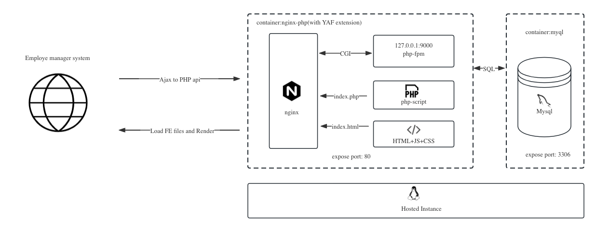

# Recruit system
[TOC]
## Background of the project
This is a simple and efficient recruitment system. Its core functionality allows job seekers to browse various positions online and submit their CVs to positions of interest via email. Recruiters can easily post and manage job information in the backend, as well as view job applications for positions.

## Project Members

- Yu Huang(Mobile Application)
- Yuqi Wang(Back End)
- Chen Zhang(Front End)
- Yonggang Li(Product)

## Quick start

# Ideas and implementation

Technology selection and coding principles:
- Meet the question requirements;
- Simple and usable;
- While reflecting sufficient coding capabilities, this simple version can lead to more and more complete details and thinking;
- Save costs in deployment;

## Architecture


## Storage design
Based on the above principles and assumptions：
- The front-end is used for independent rendering, and the back-end provides reading and writing capabilities to the front-end through HTTP API.
- Storage only relies on mysql as RDB to provide storage and query capabilities, and has no other storage services.
- The code deployment method is localized single mode. Although the front-end and back-end are isolated from the development and application dimensions through the API protocol, the deployment in the same container and the same nginx process is essentially a single service.
- A separate mysql image is used for storage, but the mysqld process and the nginx process are on the same host instance, so the entire service is still a single entity. <br/>
### Table Structure
- employer_info Table  <br/>
``` sql
CREATE TABLE `employer_info` (
  `id` bigint unsigned NOT NULL AUTO_INCREMENT COMMENT 'ID',
  `created_time` timestamp NOT NULL COMMENT 'created time',
  `updated_time` timestamp NOT NULL ON UPDATE CURRENT_TIMESTAMP COMMENT 'updated time',
  `company_name` varchar(255) NOT NULL COMMENT 'company_name',
  `official_web` varchar(255) NOT NULL DEFAULT '' COMMENT 'official website',
  `email` varchar(255) NOT NULL DEFAULT '' COMMENT 'email',
  `employer_icon` varchar(255) NOT NULL DEFAULT '' COMMENT 'employer icon',
  `employee_num` int(10) unsigned zerofill NOT NULL COMMENT 'employee num',
  PRIMARY KEY (`id`),
) ENGINE=InnoDB AUTO_INCREMENT=1 DEFAULT CHARSET=utf8mb3;
```
- position_info <br/>
``` sql
CREATE TABLE `position_info` (
  `id` int unsigned NOT NULL AUTO_INCREMENT,
  `published_employer_id` int(10) unsigned zerofill NOT NULL COMMENT 'employer id',
  `planed_hired_num` int(10) unsigned zerofill NOT NULL COMMENT 'hired num',
  `applied_num` int(10) unsigned zerofill NOT NULL COMMENT 'applied num',
  `status` int(10) unsigned zerofill NOT NULL COMMENT 'position status, 1: open, 2: close',
  `position_name` varchar(255) NOT NULL,
  `salary_range` varchar(255) NOT NULL,
  `location` varchar(255) NOT NULL,
  `postion_desc` text(2000),
  `start_time` timestamp NOT NULL COMMENT 'position start at',
  `end_time` timestamp NOT NULL COMMENT 'position end at',
  `created_time` timestamp NOT NULL,
  `updated_time` timestamp NOT NULL ON UPDATE CURRENT_TIMESTAMP,
  PRIMARY KEY (`id`)
) ENGINE=InnoDB AUTO_INCREMENT=1 DEFAULT CHARSET=utf8mb3;
```
- applied_info <br/>
``` sql
CREATE TABLE `applied_info` (
  `id` int unsigned NOT NULL AUTO_INCREMENT,
  `candidate_email` varchar(255) NOT NULL COMMENT 'candidate email',
  `position_id` int(10) unsigned zerofill NOT NULL COMMENT 'position id',
  `applied_times` int(10) unsigned zerofill NOT NULL COMMENT 'applied times for same candidate',
  `status` int(10) unsigned zerofill NOT NULL COMMENT 'applying status, 1: pass; 2: reject',
  `has_mailed` int(10) unsigned zerofill NOT NULL COMMENT 'has mailed or not, 0: not; 1: has',
  `created_time` timestamp NOT NULL,
  `updated_time` timestamp NOT NULL ON UPDATE CURRENT_TIMESTAMP,
  PRIMARY KEY (`id`)
  KEY `uniq_cadidate_position_id` (`candidate_email`,`position_id`)
) ENGINE=InnoDB AUTO_INCREMENT=1 DEFAULT CHARSET=utf8mb3;
```

## API Protocol
The interface provides services through the HTTP protocol <br/>

- Publish Position
    - Desc <br/>
        For employer publish new positions.
    - Path:
        /api/publishposition
    - Content-type:
         application/x-www-form-urlencoded
    - Method:
        POST
    - Host:
    https://xxx.com
    - Params

    | name | type | required | Desc |Sample
    | :----:| :----: | :----: | :----: | :----:
    | position_name | string | true | position name for Showing|Senior Front-End engineer|
    | location | string | false | work location| Auckland NZ|
    | salary_range | string | true | salry range| $90000-$100000 |
    | planed_hired_num | int | true | the maximum num of hired people|20|
    | desc | string | true | Job desc for this positoin| <div>This is a xxx</div>|
    | employer_id | int | true | employer ID| 2|
    | start_time | string | false | position start at, if empty means permenet position| YYY-MM-DD HH:ii:ss|
    | end_stime | string | false | position end at, if empty means permenet position| 2| YYY-MM-DD HH:ii:ss|

    - Response
    ``` json
    {
        "error_no": 0,
        "error_message": "success ",
        "data": {}
    }

    ```
- Update Position Info
    - Desc <br/>
        For updating position info by ID.
    - Path:
        /api/updateposition
    - Content-type:
         application/x-www-form-urlencoded
    - Method:
        POST
    - Host:
    https://xxx.com
    - Params

    | name | type | required | Desc |Sample
    | :----:| :----: | :----: | :----: | :----:
    | position_id | int | true | position id|
    | position_name | string | true | position name for Showing|Senior Front-End engineer|
    | location | string | false | work location| Auckland NZ|
    | planed_hired_num | int | true | the maximum num of hired people| 20 |
    | desc | string | true | Job desc for this positoin| <div>This is a xxx</div>|
    | employer_id | int | true | employer ID|12|
    | position_name | string | true | position name for Showing|Senior Front-End engineer|
    | status | int | true | position status 1 for close, 2 for open| 2|
    | start_time | string | false | position start at, if empty means permenet position| YYY-MM-DD HH:ii:ss|
    | end_stime | string | false | position end at, if empty means permenet position| 2| YYY-MM-DD HH:ii:ss|
    - Response
    ``` json
    {
        "error_no": 0,
        "error_message": "success ",
        "data": {}
    }

    ```
- Get position list
    - Desc <br/>
        For getting position list. order by updated date
    - Path:
        /api/getpositionlist
    - Method:
        GET
    - Host:
    https://xxx.com
    - Params

    | name | type | required | Desc |Sample
    | :----:| :----: | :----: | :----: | :----:
    | employer_id | int | false | employer id, if empty will recall all position |2|
    | page_size | int | false | page size, default 5 each paging |10|
    | page_num | int | false | page num, default 1  |2|
    - Response
    ``` json
    {
        "error_no": 0,
        "error_message": "success ",
        "data": {
          "list": [
                {
                    "position_id": 1,
                    "employer_id": 2,
                    "desc": "<div>Job Desc </div>",
                    "employer_name": "Google",
                    "start_time": "02/02/2024",
                    "end_time": "02/03/2024",
                    "updated_time": "15/02/2024",
                    "salary_range": "$90,000-$100,000",
                    "position_name": "Senior RD",
                    "employer_icon": "http://xxx.png",
                    "location": "Auckland, NZ",
                },
                {
                    "position_id": 2,
                    "employer_id": 2,
                    "postion_desc": "<div>Job Desc </div>",
                    "employer_name": "Google",
                    "start_time": "02/02/2024",
                    "end_time": "02/03/2024",
                    "updated_time": "15/02/2024",
                    "salary_range": "$90,000-$100,000",
                    "position_name": "Senior RD",
                    "location": "Auckland, NZ",
                }
            ],
        "has_more": true // still have next page or not.

          }
    }

    ```

- Apply for specific position
- Desc <br/>
     For applying specific position
    - Path:
        /api/apply
    - Method:
        POST
    - Host:
    https://xxx.com
    - Params

    | name | type | required | Desc |Sample
    | :----:| :----: | :----: | :----: | :----:
    | candidate_email | string | true | candidate email |xxx@gmail.com|
    | position_id | int | true | position ID |10|
    - Response
    ``` json
    {
    "error_no": 0,
    "error_message": "success ",
    "data": {}
    }
    ```
- Get applied info list
- Desc <br/>
     For getting applied info list
    - Path:
        /api/getappliedinfolist
    - Method:
        GET
    - Host:
    https://xxx.com
    - Params

    | name | type | required | Desc |Sample
    | :----:| :----: | :----: | :----: | :----:
    | employer_id | int | true | employer id |11|
    | position_id | int | true | position ID |10|
    - Response
    ``` json
    {
    "error_no": 0,
    "error_message": "success ",
    "data": {
            "list": [{
                    "applied_id": 25,
                    "candidate_email": "xxx@gmail.com",
                    "applied_times": 3,
                    "status": 1, // 1-pass, 2-reject, 0-CV wait to be reviewed  
                    "created_time": "02/02/2024",
                    "updated_time": "15/02/2024",
                    "has_mailed": true,
                },{
                    "applied_id": 34,
                    "candidate_email": "xxx@gmail.com",
                    "applied_times": 1,
                    "status": 1,
                    "created_time": "02/02/2024",
                    "updated_time": "15/02/2024",
                    "has_mailed": true,
                }],
            "has_more": true

          }
    }
    ```

- Edit applied info
    - Desc <br/>
        For Editting applied info
    - Path:
        /api/editappliedinfo
    - Method:
        POST
    - Host:
    https://xxx.com
    - Params

    | name | type | required | Desc |Sample
    | :----:| :----: | :----: | :----: | :----:
    | applied_id | int | true | applied info ID |11|
    | status | int | true | 1-pass, 2-reject|10|
    | has_mailed | bool | true | Have sent result to candidate via email, 1-has, 2-not|1|

    - Response

    ``` json
    {
    "error_no": 0,
    "error_message": "success ",
    "data": {}
    }
    ```
